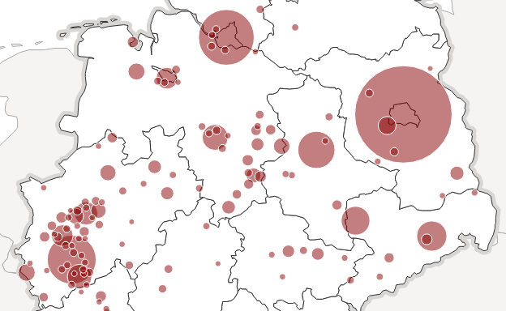

# Symbol Maps

You can add symbols to a map using the ``map.addSymbols`` function. You need to provide a config dictionary filled with at least the following properties:

* ``type`` — defines which kind of symbols you want to use
* ``data`` — an array of data objects of which each will be represented by a symbol
* ``location`` — a function which returns an array [longitude, latitude]

The following example adds exactly one label to the map:

    map.addSymbols({
        type: $K.Label,
        data: [{ name: 'Berlin', lon: 13.4, lat: 52.517 }],
        location: function(d) { return [d.lon, d.lat] },
        text: function(d) { return d.name; }
    });

## Symbol Types

### Labels

To label a layer in your map you can use . If ``location()`` returns a string in the format *"LAYER_ID**.**PATH_ID"*, Kartograph will try to calculate a nice position in the center of that layer path.

    map.addSymbols({
        type: Kartograph.Label,
        data: map.getLayer('countries').getPathsData(),
        location: function(d) { return 'countries.' + d.id; },
        text: function(d) { return d.name; }
    });

### Circles/Bubbles

See this example

    map.addSymbols({
        type: Kartograph.Bubble,
        data: map.getLayer('countries').getPathsData(),
        location: function(d) { return 'countries.' + d.id; },
        radius: function(d) { return 20; },
        style: 'fill:red',
        title: function(d) { return d.name; }
    });

### Labeled Bubbles

...

### Images

You can use the symbol API to add image marker to your map.

## Sorting Symbols

Sometimes it's useful to control the order in which symbols are drawn to the map. A typical example are sized circles that are more usable when drawn from largest to smallest.

    map.addSymbols({
        type: Kartograph.Bubble,
        sortBy: 'radius desc',
        radius: function(d) { return Math.sqrt(d.value); }
    });

## Removing Symbols

To remove a group of symbols from your map, simply call ``map.removeSymbols()``. If you added multiple symbol layers, you can pass and index to specify the one to remove. Otherwise, all symbols will be removed.

    // remove the second symbol group
    map.removeSymbols(1);
    // remove all symbol groups
    map.removeSymbols();

## Clustering Map Symbols

To activate the symbol clustering you need to add two things to the symbol config: the name clustering technique (either ``k-means`` or ``noverlap`) and a function that aggregates data objects. See [this map](/showcase/clustering) for demonstration.

    function sumVisits(cities) {
        var total = 0;
        $.each(cities, function(i, city) {
            total += city.visits;
        });
        return { visits: total };
    }

    map.addSymbols({
        type: Kartograph.Bubble,
        data: cities,
        location: function(city) { return [city.lon, city.lat]; },
        radius: function(d) { return Math.sqrt(city.nb_visits); },
        // name of clustering technique
        clustering: 'noverlap',
        // aggregation function
        aggregate: sumVisits
    });