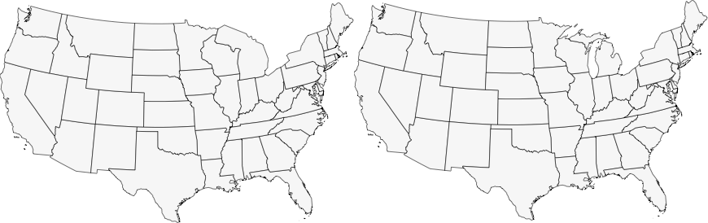

# Kartograph.py Documentation

This documentation refers to the latest version of Kartograph. *Work in progress.*

## Installing Kartograph.py

To install Kartograph.py you need to run Python (something like 2.7) and a couple of other frameworks.

* Installing on [Ubuntu](install-ubuntu.html)
* Installing on [Mac OS X](install-macosx.html)
* Installing on [Windows](install-windows.html)
* Installing using [Docker](install-docker.html)

After you installed all the pre-requisites, installing Kartograph.py should be as easy as

    python setup.py install

## Using Kartograph.py

Essentially there are two different ways of using Kartograph.py: the command-line or using the Python library.

### Kartograph.py as a command line utility

The installation script should provide you the Kartograph command line interface. To create a map, you need to write a map configuration first. Kartograph accepts JSON or YAML.

The basic usage is

    kartograph [MAP CONFIG]

This will write the map to standard output. You can write maps to a file using ``-o`` or ``--output`` option.

    kartograph config.json -o mymap.svg

Using ``--preview`` or ``-p` you can write the map to a temporary file and open it right after launch. The command to open the SVG depends on your operating system.

    kartograph config.json --preview

You can overwrite the default command by setting the environment variable ``KARTOGRAPH_PREVIEW``.

    export KARTOGRAPH_PREVIEW=firefox
    kartograph config.json --preview

For map styling you can use the ``--style`` / ``-s`` option;

    kartograph -s styles.css config.json -o mymap.svg

**Hint:** If you have some specific locations on your system where you store your raw geo data (such as shapefiles), you can tell Kartograph about them by setting the ``KARTOGRAPH_DATA`` environment variable. Kartograph will then look in these directories if it cannot find a shapefile.

    # on mac/linux:
    export KARTOGRAPH_DATA=/path/to/my/shapefiles:/another/path

    # on windows
    set KARTOGRAPH_DATA=c:\path\to\my\shapefiles;c:\another\path

As of version 0.6.3 you can force Kartograph to pretty-print the SVG using ``--pretty-print`` or ``-P``.

### Using Kartograph.py as Python module

The second way is to include Kartograph in a Python script. You could

    from kartograph import Kartograph
    K = Kartograph()
    K.generate(config, outfile='mymap.svg')

The following chapters will cover the details of the map configuration syntax. The example configurations are shown in JSON format.

## Adding Map Layers

The most important configuration (and the only one which is required) is ``layers``. Kartograph accepts a dictionary of dictionaries, with layer ids as keys.

    {
        "layers": {
            "mylayer": { },
            "anotherlayer": { }
        }
    }

For compatibility reasons, the old syntax is still supported (but possibly deprecated in the future). It accepted the layers as a list of dictionaries. You can name (and should) name the layer using ``layer.id``.

    {
        "layers": [{
            "id": "mylayer"
        }, {
            "id": "anotherlayer"
        }]
    }

If you forgot defining a layer id, Kartograph automatically named your layer as "layer_X".

## Adding Shapefile Layers    
    
If your geodata is stored in a shapefile, just pass the filename at ``layer.src``. 

    "mylayer": {
        "src": "countries.shp"
    }
    
Internally, Kartograph.py works with WGS84 coordinate system (EPSG:4326). It will look for a projection definition (which in the above example would be a file named **countries.prj**) and project the geometry back to WGS84 during import.

### Filtering map features

Sometimes you don't want your entire shapefile to be added to the map but only some selected featues. You can use ``layer.filter`` to define which shapes you want. For instance, the following definition would add only those shapes that have the data attribute *ISO3* set to "*FRA*".

    "mylayer":  {
        "src": "countries.shp",
        "filter": { "ISO3": "FRA" }
    }
    
You can build more complex filters, too. Read more about it in the [filter documentation](/docs/kartograph.py/filter.html).

**Hint:** If you use Kartograph as a Python module you might pass a function as well:

    def myfilter(record):
        return record['ISO'] == "FRA"
    
    cfg = {
        "layers": {
            "mylayer": {
                "src": "countries.shp",
                "filter": myfilter
            }
        }
    }
    K = Kartograph()
    K.generate(cfg, outfile='mymap.svg')

### Storing data attributes in SVG output

Most of the time you want Kartograph.py to include some of the data attributes defined in your shapefile. That's what you can use ``layer.attributes`` for.

    "mylayer": {
        "src": "countries.shp",
        "attributes": ["ISO3", "NAME"]
    }

The above configuration would add ``data-ISO3`` attributes to each of the rendered SVG paths.

    <path data-ISO3="USA" … />

Sometimes (actually pretty often) you find shapefiles with ugly, uppercase attributes, and you'd like to rename them. Therefor Kartograph.py accepts a dictionary in which the keys are the **new** attribute name and the values are the **source** attributes names.

    "mylayer": {
        "src": "countries.shp",
        "attributes": {
            "iso": "ISO3"
        }
    }
    
This would change the path in the resulting SVG to: 

    <path data-iso="USA" … />
    
You can also set ``layer.attributes`` to *"all"* in case you really want to store **all** data attributes in the SVG map. 

    "mylayer": {
        "src": "countries.shp",
        "attributes": "all"
    }
    
**Note:** there's a special treatment of the attribute name **id**. This would not only be added to ``data-id`` but also to the plain ``id`` attribute. This comes in handy if you want to post-process your SVG in graphic software like Illustrator, which ignores any data attributes, but displays the path ids.

    "mylayer": {
        "src": "countries.shp",
        "attributes": {
            "id": "ISO3"
        }
    }

### Specifying the input charset

While Kartograph.py tries to guess the right charset on a per shape level, you can speed up things by explicitly naming the source charset.

    "mylayer": {
        "src": "countries.shp",
        "charset": "latin-1"
    }
    
On the output-side, Kartograph.py will encode all SVGs in Unicode.

## Adding PostGIS layers

You can add a PostGIS layer by passing information about the database to ``layer.src``. To avoid conflicts with shapefiles you need to prepend "**postgis:**" to the database configuration string. Also Kartograph.py needs to know which table you want to read from.

    "mylayer": {
        "src": "postgis:dbname=osm",
        "table": "planet_osm_polygon"
    }
    
Please refer to [Psycopg documentation](http://initd.org/psycopg/docs/module.html#psycopg2.connect) for more details about the database configuration.

### Querying the database

Although you can use the built in [filtering](#filtering) of Kartograph.py on PostGIS layers, too, sometimes it is a lot faster to let PostGIS do the filtering. Therefor you can provide the ``layer.query`` attribute.

    "mylayer": {
        "src": "postgis:dbname=osm",
        "table": "planet_osm_polygon",
        "query": "boundary = 'administrative'"
    }        
    
Kartograph.py will add the provided string to the WHERE part of the query.

**Note:** you don't need to query for a given lat/lon box yourself, since Kartograph.py will do this automatically. In those cases the provided query will be AND-concatenated with the bounding box query.

### Keeping meta attributes of PostGIS geometries

Keeping the attributes (read: non-geometry columns) of your PostGIS table works exactly the same way as for [shapefile layers](#keeping-data-attributes).

### Creating Maps from OpenStreetMap data

[How to use Kartograph.py to render nice SVG maps from OpenStreetMap data](/docs/kartograph.py/osm.html)

## Simplifying map features

To reduce the file size of your SVG, Kartograph supports topology-preserving simplification. The default algorithm is the [Visvalingam-Whyatt simplification](http://www2.dcs.hull.ac.uk/CISRG/publications/DPs/DP10/DP10.html), which has nicely explained by [Mike Bostock](http://bost.ocks.org/mike/simplify/).

    "mylayer": {
        "src": "countries.shp",
        "simplify": 3
    }
    

However, Kartograph also includes two other algorithms (``douglas-peucker`` and ``distance``) which you can use by providing the following dictionary:

    "mylayer": {
        "src": "countries.shp",
        "simplify": {
            "method": "douglas-peucker",
            "tolerance": 10
        }
    }
    
The meaning of ``tolerance`` varies between the different algorithms, but in general it's the higher the tolerance, the stronger the simplification (and the smaller the file size).

## Joining features within a layer

In some situations you might want to join some polygons of a layer. For instance, you might want to create world map of continents instead of showing individual countries. To do so, you simply set the ``layer.join`` parameter.

### Joining all features to one

In the most simplest form you can join all features (of the same type) into one by just setting ``layer.join`` to **true**.

    "mylayer": {
        "src": "countries.shp",
        "join": true
    }
    
Note that the joining results in different operations depending on the geometry type. Polygonal features are joined using [union](http://toblerity.github.com/shapely/manual.html#object.union), while linear features are joined using [linemerge](http://toblerity.github.com/shapely/manual.html#shapely.ops.linemerge).

### Joining features to distinct, named groups

The next level is to join the features to several features by grouping them according to a data attribute, defined by ``layer.join.group-by``.

    "mylayer": {
        "join": {
            "group-by": "CONT"
        }
    }

Finally, you may also freely define which features should be joined into which group, by adding a dictionary ``layer.join.groups`` in which a set of values (of the attribute specified in ``group-by``) is assigned to group names (the keys). If you set ``group-as``, too, the group names will be added to the SVG, just as if they were regular attributes.

    "join": {
        "group-by": "FIPS_1",
        "groups": {
            "east": ["GM12","GM11","GM13","GM16","GM15","GM14"],
            "west": ["GM01","GM02","GM03","GM04","GM05","GM06","GM07","GM08","GM09","GM10"]
        },
        "group-as": "id"
    }

In the above example, the regions of Germany would be joined into the groups "east" and "west". The ``group-as`` property is optional. If set, the joined polygons will store the group ids as data attributes (e.g. data-id="west").

### Adding attributes to joined features

There are two ways you can add attributes to joined features. You can define them per group-id, or use copy them from one of the source features.

The first example shows how to copy an attribute from one source feature to the joined feature. Assuming we have a list of features with an attribute REGION_ID and REGION_NAME, which we want to join by region. This is how you include the region names as new attribute "name".

    "join": {
        "group-by": "REGION_ID",
        "attributes": {
            "name": "REGION_NAME"
        }
    }

By passing a dictionary you can define new attribute values for each joined feature. The keys must be group ids (as defined by ``group-by`` column).

    "join": {
        "group-by": "REGION_ID",
        "attributes": {
            "name": {
                "01": "Bordeaux",
                "02": "Normandie"
            }
        }
    }

### Buffer polygons before joining

Sometimes, when adjacent features in the source geometries are not using the exact coordinates the joining of map features results in ugly lines inside of the joined polygons. To get around this you actually should try to get higher quality geo data, as there is no easy way to fix the topology automatically. However, there is a simple trick that sometimes works, which is to apply a tiny buffering to the polygons before joining them. The buffering moves the polygon border to the outside, and thus eleminates 'holes' between adjacent features. Usually you only need very very small buffering to fix these issues.

    "join": {
        "group-by": "REGION_ID",
        "buffer": 0.0000001
    }

## Layer Subtraction and Cropping

Sometimes you need to subtract polygons from one layer from the polygons of another layer. One example use case is when you have state boundaries and lakes in different shapefiles. You can make Kartograph do this by setting the ``layer.subtract-from`` attribute to the id of the layer you want to subtract from. You can also subtract a layer from more than one other layers by providing an array of layer ids.

    "countries": {
       "src": "ne_adm_level0.shp"
    },
    "lakes": { 
       "src": "ne_10m_lakes.shp",
       "subtract-from": "countries"
    }
    

    
Source: [left](/maps/#3434004), [right](/maps/#3434486)

    
### Cropping layers to another layer

Another use case is that you need to crop a layer to a existing layer. You can do so by setting the crop-to option. Assuming a shapefile that has forestation polygons for Europe, the following would crop the forests to the shape of Germany:

    "germany": {
        "src": "ne_adm_level0.shp",
        "filter": {
            "ISO_A3": "DEU"
        }
    },
    "forests": {
        "src": "forests_of_europe.shp",
        "crop-to": "germany"
    }

## Special Layers: Graticule and Sea

### Graticule

The following would add graticule lines for every 5°.

    "mygraticule": {
        "special": "graticule",
        "latitudes": 5,
        "longitudes": 5
    }

### Sea 

The sea layer is especially useful in non-rectangular world maps, where the 'background' layer could be a circle, a cone or whatever geometry.

    "background": {
        "special": "sea",
    }

## Projection 

Of course, you may want to define the map projection that will be used to project the geo data:

    "proj": {
        "id": "laea",
        "lon0": 11.0,
        "lat0": 52
    }

Other projections might support different parameters:

    "proj": {
        "id": "satellite",
        "lon0": 11.0,
        "lat0": 52.0,
        "dist": 1.3,
        "up": 45.0
    }

In some situations you can leave out some projection parameters or set them to "auto". Then, Kartograph will try to figure out useful values itself (e.g. the geographic center of the displayed polygons). You can even mix automatic and user-defined projection parameters:

    "proj": {
        "id": "robinson",
        "lon0": "auto",
        "lat0": 52.0
    }

For a list of all available map projections and their parameters, check out this page (todo).

## Framing the Map

Often you don't want to render the entire globe, but a smaller section of it. Kartograph supports different convenient ways to define how to clip the map.

### Clipping to a longitude/latitude range (bbox)

The mode **bbox** allows you to define minimum and maximum values for latitude and longitudes. Kartograph will ensure that the entire lon,lat is visible in the map. Note that the layer polygons are _not_ cropped to the viewport rectangle, but to the lon/lat range, whose actual shape depends on the used map projection.

The data format is ``[minLon, minLat, maxLon, maxLat]``.

    "bounds": {
        "mode": "bbox", 
        "data": [70, 17, 135, 54]
    }

If no bounds are set up at all, Kartograph will fallback to the full lon/lat range [-180, -90, 180, 90].

### Clipping to map features (polygons)

In some situations you don't want to mess around with lon/lat bounding boxes, but you simply want one or many polygons to be fully visible in the map. That's what the **polygons** mode is for. In this mode ``bounds.data`` requires at least the ``layer`` to which the map should be clipped to.

    "bounds": {
        "mode": "polygons",
        "data": {
            "layer": "countries",
        }
    }

    
Sometimes you just want to focus the map on one feature while keeping other features visible around it. Therefor you can add ``filter`` to the bounds data attribute. It uses the same filter syntax as seen in the [layer section](#filtering).

    "bounds": {
        "mode": "polygons",
        "data": {
            "layer": "countries",
            "filter": ["NE_ISO_3", "in", ["DEU","FRA","ITA","GBR"]]
        }
    }

The **layer** option refers to the id of a layer defined in the [layers section](#layers).

### Omitting tiny islands in boundary calculation

But wait, now comes the tricky part of using automatically calculated bounding boxes for geographic polygons. Since many geographic regions consist of multiple polygons, you often don't want to crop your map to the full extends. If you, for instance, want to crop the map to Spain you probably don't want have all these tiny islands included (see image above). Therefore, Kartograph allows you to set the parameter **min_area**. The bounding box calculation will ignore every polygon whose area is less than **min_area** multiplied with the area of the largest polygon.

    "bounds": {
        "mode": "polygons",
        "data": {
            "layer": "countries",
            "filter": {
                "NE_ISO_3": "ESP"
            },
            "min-area": 0.20,
            "padding": 10
        }
    }

### Clipping to a rectangle that includes a set of points

The **points** mode allows you to define a set of points (that is pairs of lon/lat values), that will be visible in the map. Kartograph will crop the map to the smallest rectangle that includes all defined points. Note that the calculation is done _after_ the projection of the coordinates.

    "bounds": {
        "mode": "points",
        "data": [[11.2,34.2],[23,33.3]]
    }

## CSS-Styling

Kartograph.py allows you to style your SVG maps using CSS.

On the command line you can use the ``-s`` or ``--style`` parameter.

    kartograph -s style.css config.json -o map.svg
    
In Python you need to read the stylesheet yourself and pass its content using the ``stylesheet`` attribute:

    from kartograph import Kartograph
    css = open('style.css').read()
    K = Kartograph()
    K.generate(config, outfile='map.svg', stylesheet=css)
    
### Per-layer styling

To style a specific layer you simply define a rule for the layer id.

    #mylayer {
        fill: red;
    }
    
### Re-use styles for several layers

Of course you can re-use a given style for several layers by applying it to multiple (layer) ids.

    #mylayer, #anotherlayer {
        stroke: none;
    }
    
However, if you have lots of layers this might be a bit too much. Another way is to assign classes to your layers

    "mylayer": {
        "class": "roads"
    }
    
Then you can add per-class styles just as you would do in HTML.

    .roads {
        stroke-width: 2px;
    }
    
### Conditional styling

Sometimes you want to apply some styles depending on data attributes. Therefor Kartograph.py supports a CSS3 attribute selector-like\* syntax. The following style is applied to all paths with an attribute "highway" that equals "motorway".

    .roads[highway=motorway] {
        stroke-width: 4px;
    }

\* Actually Kartograph.py supports a bit more than CSS3. You can

* check if an attribute **begins with** a given string using ``|=``
* check if an attribute **ends with** a given string using ``=|``
* check if a numerical attribute is **greater** or **smaller** than a given value using ``>``, ``<``, ``>=``, and ``<=``.

Using the numerical comparators you could easily apply a choropleth-like styling to your map.

    #states[crimerate<0.1] {
        fill: lightgreen;
    }
        
    #states[crimerate>0.4] {
        fill: darkred;
    }
   

## Setting Export Parameters

In the ``export`` section you can customize the following things.

### Map size

    "export": {
       "width": 1000,
       "height": 500
    }

Instead of defining the width/height explicitly, you can also use a combination of width/height and a **ratio**. 

    "export": {
       "width": 1000,
       "ratio": 0.5
    }

If you leave out either the width or height and have no ratio specified, Kartograph will automatically use the ratio of the projected map.

    "export": {
       "width": 1000
    }

### Round coordinates

If you set ``export.round`` to other values than **false** (which is the default), all point coordinates will be rounded to the specified number of digits. The following would force Kartograph to round all coordinates to the first decimal digit (e.g. 115.4 instead of 115.38749493). This significantly reduces the file size of the resulting maps.

    "export": {
       "round": 1
    }

## Labeling of map features

You can add text labels to your map features using the ``layer.labeling`` configuration. To make it work you at least need to specify the attribute to use as label texts using the ``key`` property.

    "mylayer": {
        "src": "…",
        "labeling": {
            "key": "NAME_1"
        }
    }
    
### Styling map labels

To change fonts and colors of your map labels, simply add a CSS rule for ``YOURLAYERID-label``. In the above example this would be:

    #mylayer-label {
        font-family: Georgia;
        font-size: 14px;
    }
    
 
