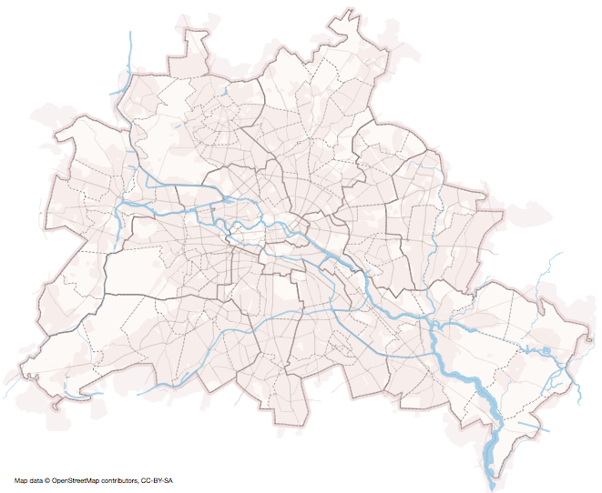

# Rendering SVG maps from OpenStreetMap data

This step-by-step tutorial explains how to render nice SVG maps from OpenStreetMap (OSM) data using PostGIS, osm2pgsql and Kartograph.py.

Source: [#3082969](/maps/#3082969)

## Setting up the PostGIS database

After installing [PostgreSQL](http://www.postgresql.org/) and the [PostGIS extension](http://postgis.refractions.net/), you need to create a new database for the OSM data.

    > createdb osm

Activate PostGIS on that database. You need to know where you installed PostGIS to find the postgis.sql and  spatial_ref_sys.sql. For instance, if you installed PostGIS on Mac OS using homebrew, you find them under ``/usr/local/Cellar/postgis/1.5.3/share/postgis/``.

    > psql -d osm -f path/to/your/postgis.sql
    > psql -d osm -f path/to/your/spatial_ref_sys.sql

## Import OpenStreetMap data

Download a fresh OpenStreetMap dump. You can use either the XML version (.osm) or the binary version (.osm.pbf).

    > wget http://download.geofabrik.de/osm/europe/germany/berlin.osm.pbf

Install [osm2pgsql](http://wiki.openstreetmap.org/wiki/Osm2pgsql) and import the OSM dump into the database. 
This can take quite a while (and consume lots of RAM), depending on the actual size of the dump.

    > osm2pgsql -l -r pbf -d osm berlin.osm.pbf

## Render the SVG map

And that's it. Now you can create a map using the [latest bleeding edge version of Kartograph](https://github.com/kartograph/kartograph.py/tree/kartograph-2) and the following minimal map configuration:

    {
        "roads": {
            "src": "postgis:dbname=osm",
            "table": "planet_osm_roads"
        }
    }

Store this as ``map.json`` and run ``kartograph map.json -o map.svg`` to get a map like this:

